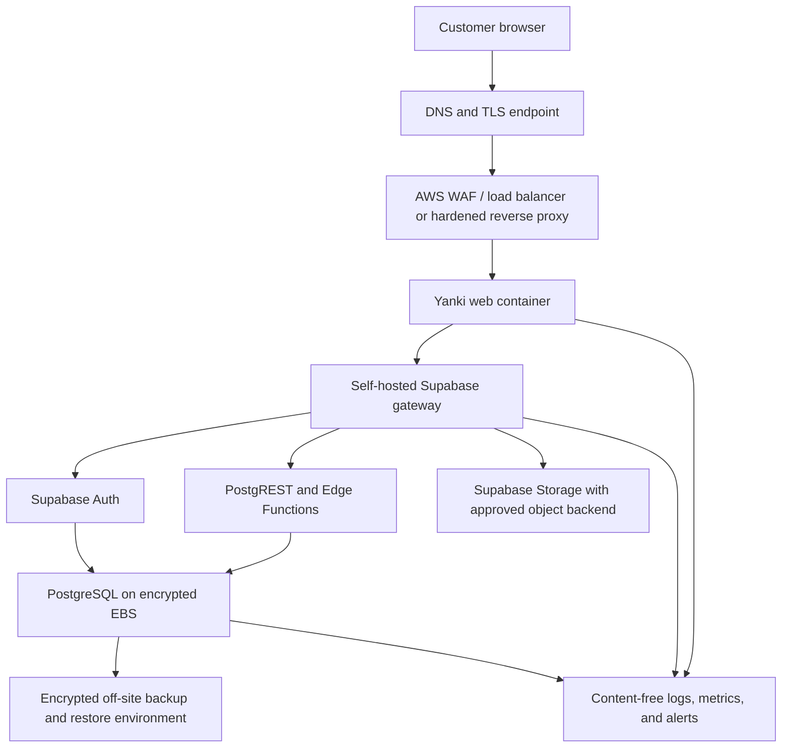

# Production Readiness Assessment

## Scope

This assessment prepares the current product for two supported deployment modes without changing screens, user flows, evaluation behavior, or the anonymity model:

1. Vendor-operated shared SaaS for many customer organizations.
2. Customer-managed dedicated installation using the same application release and database migrations.

The primary target is a central SaaS deployment on AWS EC2 with Docker Compose and self-hosted Supabase/PostgreSQL/Auth/Storage. The AWS self-hosted stack is also the canonical development and integration-test backend. The former managed Supabase project is retained only as historical context and must not receive development or test traffic.

## Executive Decision

`organizations.id` remains the canonical tenant identifier. `user_profiles` represents the global Auth identity, while `organization_unit_memberships`, organization-scoped roles, projects, cycles, assignments, retention policies, and evaluation data establish tenant participation. Creating parallel `companies` or `company_users` tables would duplicate the existing model and introduce inconsistent authorization paths.

The current schema is substantially ready for shared multi-tenancy:

- Every application table created by migrations has Row Level Security enabled.
- Browser table access is default-deny except the authenticated user's own profile.
- Sensitive operations are performed through authenticated Edge Functions and narrow service-role-only functions.
- Tenant-bearing relationships use `organization_id` and composite foreign keys where cross-tenant reference risk exists.
- Evaluation content is AES-GCM encrypted before persistence and evaluator identity is separated from submission content.
- Secrets, database credentials, the service role, and encryption keys are excluded from browser runtime configuration and source control.
- Audit events contain safe metadata and scoped event references, never evaluation content.
- Supabase Storage is not currently used by product behavior, so no unused bucket or speculative policy is added.

The immediate application defect found by this audit was platform-global security diagnostics accepting any active `SYSTEM_ADMIN`, including organization-scoped administrators. Migration `20260812120000_platform_security_operations_scope.sql`, the related Edge Functions, and the administration module visibility now require an exact active `PLATFORM` scope for those diagnostics. Tenant administration remains organization-scoped.

## Current Architecture Inventory

| Area | Current source-controlled state | Production assessment |
| --- | --- | --- |
| Tenant boundary | `organizations.id`, memberships, tenant-scoped roles, projects, cycles, assignments, templates, and retention policies | Keep; no parallel tenant model |
| Authentication | Supabase Auth identity plus application profile and membership checks | Portable to self-hosted GoTrue/Supabase Auth |
| Authorization | RLS, explicit grants, Edge Function checks, and transactional database checks | Strong baseline; retain layered enforcement |
| Evaluation content | Encrypted payloads; evaluator identity is not stored with content | Strong baseline; key custody remains an operator gate |
| Audit | `audit_events` with actor, typed scope, safe metadata, and RLS | Sufficient for current internal operations; add tenant export only when a customer-facing audit feature is designed |
| Storage | No product bucket or object dependency | No action now; policy and backup gate applies before first Storage feature |
| Releases | Signed, digest-pinned multi-platform OCI release with SBOM and provenance | Suitable for SaaS and dedicated installations |
| Backups | Encrypted off-site Restic logical backups and restore acceptance | Keep; add infrastructure snapshots and evaluate WAL/PITR before production |
| Monitoring | Content-free abuse alerts plus documented health checks | Add host, database, certificate, backup-age, capacity, and container monitoring before production |

## Target AWS Topology

The first production version may place these containers on one adequately sized EC2 host only after load testing and recovery acceptance. Keep the database and internal Supabase services off public interfaces. Expose only the TLS entry point, restrict administration through VPN/bastion/SSM, encrypt EBS, require IMDSv2, use least-privilege instance roles, and keep backups in a separate failure and credential boundary.

AWS announced the [Istanbul Local Zone](https://aws.amazon.com/about-aws/whats-new/2026/05/aws-local-zones-istanbul-turkiye/) in May 2026 with selected EC2, EBS, networking, and related services. A Local Zone is not a complete independent AWS Region. The parent-region control plane and any service not explicitly available in Istanbul may process or store metadata or data outside the Local Zone. The production data-residency promise must therefore be based on a reviewed data-flow inventory, not only the EC2 placement label. AWS also provides its [Istanbul infrastructure and sustainability overview](https://aws.amazon.com/blogs/infrastructure-sustainability/now-open-aws-local-zones-in-istanbul-turkiye/).

## Data Residency Inventory

Before contracts claim that customer data stays in Turkiye, record and approve the actual location for each row below:

| Data flow | Required decision |
| --- | --- |
| EC2 compute and EBS volumes | Verify the selected instance and volume types are available in the Istanbul Local Zone |
| EBS snapshots and AWS Backup | Verify physical placement, copy policy, retention, encryption key location, and parent-region behavior |
| Object storage and Supabase Storage | Verify backend region, replication, versioning, public-access block, and deletion lifecycle |
| Auth email and SMTP | Record provider, message content, routing, logs, and retention location |
| DNS, certificates, WAF, and load balancer | Record control-plane and request-log locations |
| Logs, metrics, traces, and alert webhooks | Prohibit evaluation content and document processing/storage locations |
| GitHub/GHCR release metadata | Treat as software supply-chain data, never customer evaluation data |
| Off-site backups and recovery keys | Record country, account, administrator, retention, and restore access |

## Environment Separation

| Environment | Data | Supabase | Secrets | Access |
| --- | --- | --- | --- | --- |
| Development | Synthetic only | Managed development project or local Docker | Developer-local values | Developers |
| Staging | Synthetic production-like fixtures | Isolated self-hosted stack | Independent non-production keys | Restricted team and CI |
| Production | Approved customer data | Isolated production self-hosted stack | Production secret manager/KMS and independently escrowed evaluation keys | Named operators only |

Never reuse JWT secrets, database passwords, service-role tokens, gateway tokens, SMTP credentials, webhook tokens, backup credentials, or evaluation encryption keys between environments. A production restore drill must restore into an isolated recovery environment, never over development or the active database.

## Self-Hosted Supabase Compatibility

The application requires PostgreSQL, Supabase Auth, PostgREST/API gateway behavior, Edge Functions, and `pgcrypto`. `pgTAP` is required only for database tests. Product code currently has no Storage object dependency.

Use an exact reviewed Supabase self-hosting commit or release and record it in the environment release manifest. Apply every repository migration in order, deploy every repository Edge Function, and run the same clean-stack tests before promotion. Supabase recommends Docker for self-hosting and states that the operator owns security, maintenance, backups, availability, and monitoring; see the [self-hosting overview](https://supabase.com/docs/guides/self-hosting) and [Docker guide](https://supabase.com/docs/guides/self-hosting/docker). If Storage is introduced, select and test the object backend explicitly; Supabase documents a configurable [S3-compatible Storage backend](https://supabase.com/docs/guides/self-hosting/self-hosted-s3).

The repository now pins the official Supabase Docker source in `deploy/staging/supabase.lock.json`, verifies critical upstream hashes, and provides both configuration-only and full clean-stack acceptance commands. The resource-efficient local Docker gate passed Compose validation, 186 pgTAP assertions, the production-container browser lifecycle, same-origin gateway denial, accessibility, responsive overflow, and streamed restore on 2026-08-12. This is useful development evidence but does not close the production-like staging requirement below; the full pinned stack must still pass on an isolated, properly sized staging host with real environment controls.

The account-neutral host layer is now reproducible in `deploy/staging/aws`: OpenTofu is checksum-pinned, the AWS provider is locked, the host uses SSM instead of inbound SSH, only public web ingress is defined, IMDSv2 and KMS-encrypted storage are required, and cloud-init contains no application secret. Local format/provider/configuration validation passed on 2026-08-16. No AWS account plan or resource apply has occurred, so this closes only the infrastructure-definition substep, not the production-like staging gate.

The existing AWS development host gained a backup-first production Nginx/Caddy web layer on 2026-08-18. Same-origin Auth, required gateway-token forwarding, direct sensitive-route denial, request-body limits, loopback-only internal ports, container health, and data preservation passed internal acceptance. External ACME and browser acceptance remain blocked because the host's separately managed Security Group does not yet allow TCP 80/443. This synthetic development evidence does not close the isolated production-like staging or production gate.

## Priority Plan

### Critical Before Production

- Keep platform-global operational diagnostics restricted to exact `PLATFORM` administrators at UI, Edge Function, and database layers. Implemented by this assessment.
- Review and apply the committed staging-host OpenTofu plan in the dedicated AWS staging account, then deploy the pinned self-hosted Supabase version and signed Yanki image; run migration, authorization, browser, gateway, and recovery acceptance there.
- Terminate TLS with an approved certificate, keep PostgreSQL and internal Supabase ports private, restrict operator access, and prove direct sensitive-endpoint denial.
- Store production service-role, JWT, database, SMTP, gateway, webhook, backup, and encryption secrets outside images, source, browser configuration, and ordinary logs.
- Complete independent encryption-key custody, encrypted remote backup, isolated restore, RPO/RTO, and alert-delivery acceptance with named owners.
- Add infrastructure monitoring for host capacity, EBS pressure, database health, container restarts, certificate expiry, backup age, recovery-canary health, and alert pipeline failure without sensitive payloads.
- Approve the data-residency inventory and contract wording for the exact AWS services and external providers used.
- Configure an approved SMTP path and complete invitation/password recovery acceptance before real users.
- If any Storage-backed feature is added, require tenant-prefixed object paths, private buckets, reviewed `storage.objects` RLS policies, signed/short-lived access, lifecycle rules, and independent object backup before release.

### Recommended Before Production

- Add encrypted EBS snapshot automation and evaluate continuous WAL archiving/PITR in addition to the existing logical Restic recovery path.
- Define monthly OS/container/Supabase patching, vulnerability response, emergency rollback, and supported-version windows.
- Centralize content-free infrastructure logs with retention, access review, clock synchronization, and alert ownership.
- Run capacity and failure tests using representative tenant/member/project/evaluation volumes; document single-host limits.
- Require two-person approval for production key rotation, restore, and emergency privileged access.
- Add a tenant-aware operational audit export only after its readers, retention, and redaction contract are designed; do not expose raw `audit_events` directly to browsers.

### After First Customers

- Measure real load and tune PostgreSQL connections, indexes, worker concurrency, quotas, and EC2/EBS sizing from observed metrics.
- Automate customer onboarding evidence, tenant lifecycle reporting, support access approvals, and customer-facing security documentation.
- Add tested regional disaster-recovery procedures if contracts require a second site, while making cross-border implications explicit.
- Add a dedicated-installation compatibility matrix and upgrade rehearsal for each supported Supabase release.

### At Scale

- Separate database, API/Functions, and web workloads when measured contention justifies it.
- Introduce PostgreSQL high availability, replicas, connection pooling, or managed orchestration only with tested failover and the same authorization model.
- Consider tenant sharding or dedicated high-sensitivity deployments when contractual isolation, workload size, or noisy-neighbor measurements justify them.
- Move from single-host Compose to a reviewed orchestrator only when operations capacity and availability objectives require it; orchestration does not replace tenant authorization or recovery design.

## Production Acceptance Evidence

Production approval requires dated evidence for:

1. Signed image and release-manifest verification.
2. Clean self-hosted migration and Edge Function deployment.
3. RLS, explicit privilege, tenant-isolation, self-access denial, administrator denial, and platform-operation scope tests.
4. TLS, private-network, direct-endpoint, rate-limit, and request-size controls.
5. Encrypted backup creation, integrity check, isolated restore, and key/database recovery canaries.
6. SMTP invitation and password-recovery delivery.
7. Monitoring and alert receipt for host, database, application, certificate, backup, and recovery failures.
8. Data-residency inventory, processor list, retention policy, incident contacts, RPO/RTO, and customer-facing security statement.

Until all Critical Before Production items have evidence, the system is not approved for live employee evaluation data.
